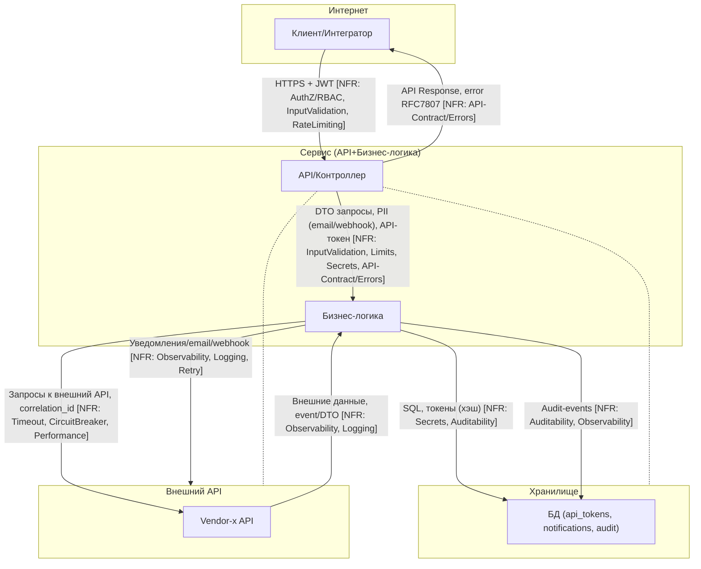

# S04 — DFD

```mermaid
flowchart TD
  subgraph INTERNET["Интернет"]
    CLIENT["Клиент/Интегратор"]
  end

  subgraph API["Сервис (API+Бизнес-логика)"]
    APIENTRY["API/Контроллер"]
    SERVICE["Бизнес-логика"]
  end

  subgraph STORAGE["Хранилище"]
    DB["БД (api_tokens, notifications, audit)"]
  end

  subgraph EXTERNAL["Внешний API"]
    EXTAPI["Vendor-x API"]
  end

  %% Потоки от клиента → сервис
  CLIENT -- "HTTPS + JWT [NFR: AuthZ/RBAC, InputValidation, RateLimiting]" --> APIENTRY
  APIENTRY -- "DTO запросы, PII (email/webhook), API-токен [NFR: InputValidation, Limits, Secrets, API-Contract/Errors]" --> SERVICE

  %% Основные сервисные потоки
  SERVICE -- "SQL, токены (хэш) [NFR: Secrets, Auditability]" --> DB
  SERVICE -- "Audit-events [NFR: Auditability, Observability]" --> DB
  SERVICE -- "Уведомления/email/webhook [NFR: Observability, Logging, Retry]" --> EXTERNAL
  SERVICE -- "Запросы к внешний API, correlation_id [NFR: Timeout, CircuitBreaker, Performance]" --> EXTAPI
  EXTAPI -- "Внешние данные, event/DTO [NFR: Observability, Logging]" --> SERVICE

  %% Ответы клиенту
  APIENTRY -- "API Response, error RFC7807 [NFR: API-Contract/Errors]" --> CLIENT

  %% ГРАНИЦЫ ДОВЕРИЯ
  APIENTRY -....- STORAGE
  APIENTRY -....- EXTERNAL
```
